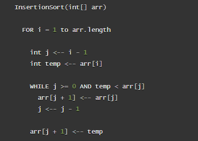
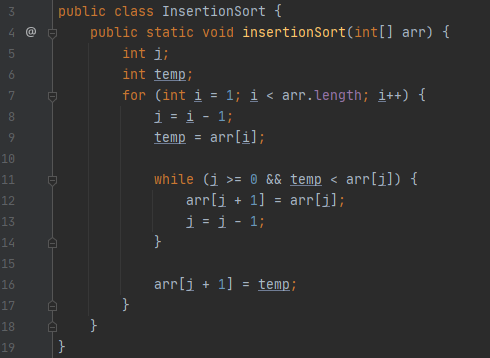

# Algorithm Blog

  - [Insertion Sort 10/19/20](#insertion-sort)

---

## Insertion Sort

Insertion Sort is a sorting algorithm that sorts values as they are encountered front to back. This means that every position before the value being checked has already been sorted. So as each value is checked, in order to place it into the already sorted section, and value larger then the value checked will move forward in position in order to make room.

### Pseudo Code Example

### Java Code Sample

### Walkthrough

The first value of the array can be considered sorted. So the first pass will check the second value against the sorted section (the first value). In the sample below, the second value, 4, is less than the first value, 8. This triggers the second position in the array to be assigned the value 8. And since there are no lower values to check, the 4 is assigned to the first position.

The next couple iterations will check the values 23 and 42 respectively. Both of these will fail the conditional to enter the while loop since they'll be greater than the highest of the previously sorted values. Essentially all that happens is they're stored in a temp variable and then they are overwritten by the temp variable, resulting in no change to the array.

The fifth position, value of 16, is a perfect example of how this algorithm operates. The temp variable will assigned 16 and since that is less than 42, the conditional to enter the while loop will resolve to true.

This causes the fifth position to be overwritten with the value of the 4th position, 42, and the j index will iterate backwards to check the next highest sorted value.

The same process repeats since 16 is less than the third value, 23. The value of 23 is assigned to the fourth position and the j index continues to iterate down.

The 16 will be greater than the next value, 8, so the while loop is passed and the third position gets the temp value, 16.

Essentially, every new value being sorted is checked against the previously sorted section. And in order to make room for that value, any previously sorted value that is higher than the new value needs to move one index higher in the array. This leaves the appropriate space for the new value to be in its sorted position.

### Efficiency

Time Efficiency: O(n2) - exponential
  - The worst case is closer to O((n-1) * (n-1)/2))
  - For each point of the array, every previous point will be iterated through, which will be very short at the start and the full length by the end

Space Efficiency: O(1) - constant
  - The operations are done in place using a few variables to keep track of two indices and the value currently being sorted

---

