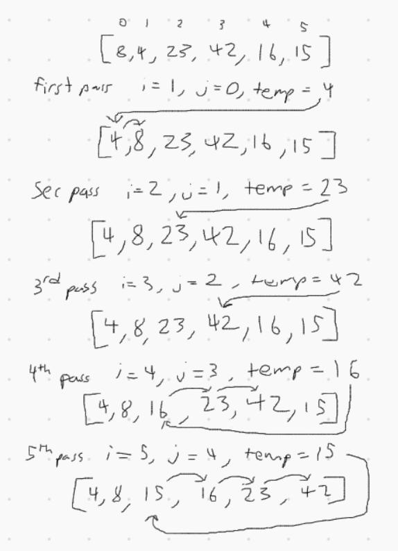
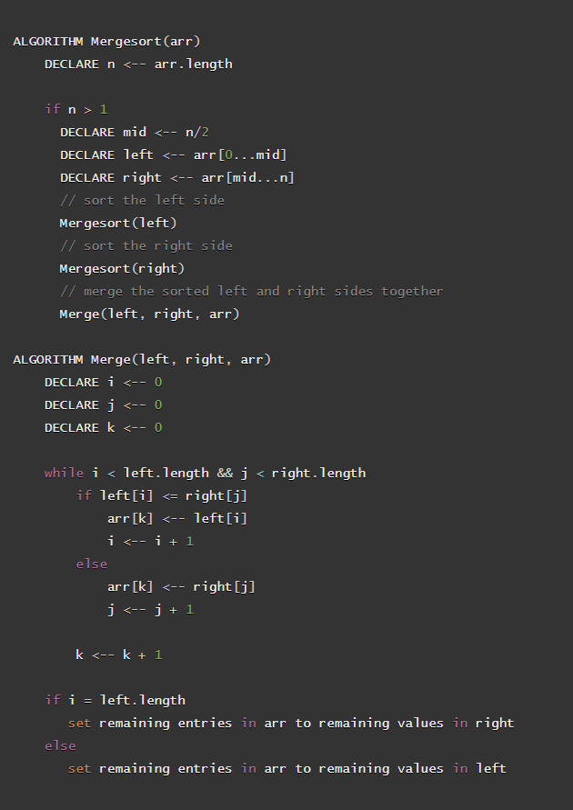

# Algorithm Blog

  - [Insertion Sort 10/19/20](#insertion-sort)
  - [Merge Sort 10/19/20](#merge-sort)
  - [Quick Sort 10/19/20](#quick-sort)

---

## Insertion Sort

Insertion Sort is a sorting algorithm that sorts values as they are encountered front to back. This means that every position before the value being checked has already been sorted. So as each value is checked, in order to place it into the already sorted section, and value larger then the value checked will move forward in position in order to make room.

### Pseudo Code Example

### Java Code Sample

### Walkthrough

The first value of the array can be considered sorted. So the first pass will check the second value against the sorted section (the first value). In the sample below, the second value, 4, is less than the first value, 8. This triggers the second position in the array to be assigned the value 8. And since there are no lower values to check, the 4 is assigned to the first position.

The next couple iterations will check the values 23 and 42 respectively. Both of these will fail the conditional to enter the while loop since they'll be greater than the highest of the previously sorted values. Essentially all that happens is they're stored in a temp variable and then they are overwritten by the temp variable, resulting in no change to the array.

The fifth position, value of 16, is a perfect example of how this algorithm operates. The temp variable will assigned 16 and since that is less than 42, the conditional to enter the while loop will resolve to true.

This causes the fifth position to be overwritten with the value of the 4th position, 42, and the j index will iterate backwards to check the next highest sorted value.

The same process repeats since 16 is less than the third value, 23. The value of 23 is assigned to the fourth position and the j index continues to iterate down.

The 16 will be greater than the next value, 8, so the while loop is passed and the third position gets the temp value, 16.

Essentially, every new value being sorted is checked against the previously sorted section. And in order to make room for that value, any previously sorted value that is higher than the new value needs to move one index higher in the array. This leaves the appropriate space for the new value to be in its sorted position.

### Efficiency

Time Efficiency: O(n2) - exponential
  - The worst case is closer to O((n-1) * (n-1)/2))
  - For each point of the array, every previous point will be iterated through, which will be very short at the start and the full length by the end

Space Efficiency: O(1) - constant
  - The operations are done in place using a few variables to keep track of two indices and the value currently being sorted

---

## Merge Sort

Merging two sorted arrays into one sorted array is relatively simple. Merge Sort is an algorithm that takes advantage of this by recursively splitting an unsorted array into progressively smaller halves. Any array of length 1 is inherently sorted. So once the input array has been split into arrays with single elements, each of the resulting arrays can be merged back to the full size while maintaining sorted order.

### Pseudo Code Example

### Java Code Sample

#### Merging Helper Function

### Walkthrough

In this sample, the input array is `[8, 4, 23, 42, 16, 15]`. At a high level, mergeSort takes the input array, splits it in half, calls mergeSort on both halves, and merges the sorted result. Obviously it goes a bit further than that, so let's follow the left half down the stack.

The first `left` to get mergeSorted is `[8, 4, 23]`. This in turn goes through the same process and splits into `[8]` and `[4, 23]`. Looks like we'll need to keep going. We'll follow the new left, `[8]`.

This left is the first we've encountered with a length of 1. That is our base case! Because it's already sorted, it immediately exits, leaving the left array as is.

So now we'll follow the right, `[4, 23]`. Its length is still greater than 1, so it splits into `[4]` and  `[23]`. Since each of these are length 1, they'll both stay the same similarly to the `[8]` we followed previously.

Now that we have found both a left and a right that did not change, they're ready to merge. The merge function is called and overwrites `[4, 23]` with the values in `[4]` and `[23]` in sorted order (which is still `[4, 23]`). This is the right to match the left of `[8]`.

The left `[8]` now merges with right `[4, 23]`, resulting in `[4, 8, 23]`. And that is the whole left side of the input array sorted. Once the right side goes through the same process, it looks like `[15, 16, 42]`. And the final merge of those results in our output, `[4, 8, 15, 16, 23, 42]`.

### Efficiency

Time Efficiency: O(nlogn) - linearithmic
  - The merge helper function is in linear time because it sets each value based on a simple comparison
  - The merge gets called (logn) times due to the recursive halving of the array
  - Combining those, we come to O(nlogn)

Space Efficiency: O(n) - linear
  - While it looks like there will be more space used, the recursion depth is (logn)
  - The stack will resolve its left route before entering its right route, maintaining a relative amount of space needed to the size of the input array

---

## Quick Sort

Quick Sort is a sorting algorithm that operates by taking a value from the array, called the pivot, and using it as reference for a series of swaps. Any value lower than the pivot gets swapped into the lower portion of the array until all values are checked. Then the pivot is added at the end of the lower values. This results in all the values to the left of the pivot being lower than it and all values to the right are higher, meaning the pivot is exactly where it needs to be in the end. Then quick sort just needs to be run to the left and the right of the pivot recursively to finish the sort.

### Pseudo Code Example

### Java Code Sample

### Walkthrough

In this sample, the input array is `[8, 4, 23, 42, 16, 15]`. The pivot for this implementation is the right most value, 15. The first value, 8, is compared to the pivot and it's lower. So the 8 is set into the first array postition. Since it's already there, there's no visible effect.

The same thing happens with the 4. It's less than 15, so it's set in the next available array position, which is where it already was. So still no visible effect. 

The next 3 values are all higher than the pivot, leaving only the final step of the round. The pivot is then swapped with the first higher value, the 23. Now the 15 is the 3rd element in the array and is sorted.

The same process is to the left and right of the pivot. The pivot for the left is 4 which results in a swap with the 8. The 4 being set correct, the 8 is treated as the next pivot. However, since the 8 has pivots to its left and right, it immediately resolves because it must be in the correct location.

The same process happens on the right side of the origin pivot. 23 is the new pivot, resulting in the 16 swapping left and the 42 swapping right. And the next round, both the 16 and 42 immediately resolve because they are sandwiched between known good positions.

The amazing advantage to this is that every round of sorting positions one element into its final location. But it also organizes other elements in the process. Each round ideally makes future rounds require less checks.

### Efficiency

Time Efficiency: O(n2) - exponential
  - It's possible for this algorithm to run in (nlogn) time
  - Unfortunately, if the input is already sorted, this implementation reaches exponential time

Space Efficiency: O(logn) - logarithmic
  - While it looks like there will be more space used, the recursion depth is (logn)
  - The stack will resolve its left route before entering its right route, maintaining a relative amount of space needed to the size of the input array
