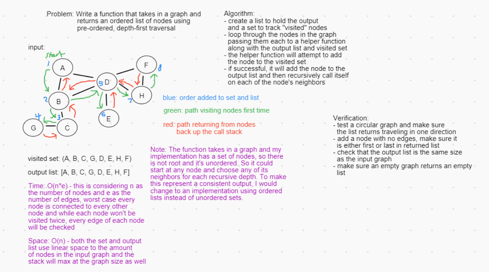
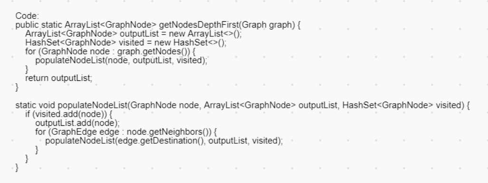

# Graph Traverse Depth First

A pre-order, depth-first traverse of a graph.

## Challenge

Write a function that takes in a graph and returns an ordered list of nodes using pre-ordered, depth-first traversal.

## Approach & Efficiency

[Link to Code](src/main/java/DataStructures/graph/depthFirst/DepthFirst.java)

[Link to Graph implementation](src/main/java/DataStructures/graph/Graph.java)

I started by making a list to hold the eventual output and a set to keep track of nodes added to the list. If the graph is not empty, it loops through each of its nodes and passes them to a helper function along with the list and set. After the loop resolves, the output list will be filled with each node in the order they are encountered and it is returned.

The helper function is a recursive function. It first checks for a base case. If the node passed is already in the set of visited nodes, the helper function immediately exits back up the call stack. Otherwise, the node is added to the set and added to the list (as it's the first time it has been visited). And then each of its neighboring nodes are passed recursively through the helper function.

- O(n*e) Time - A worst case on this would be a graph where every node is connected to every other node, possibly even multiple times. Every node will be visited once (n being the number of nodes) and each of their edges must be checked (e being the number of edges).
- O(n) Space - The output list, visited set, and call stack all max out at the size of the input graph.

## Solution

