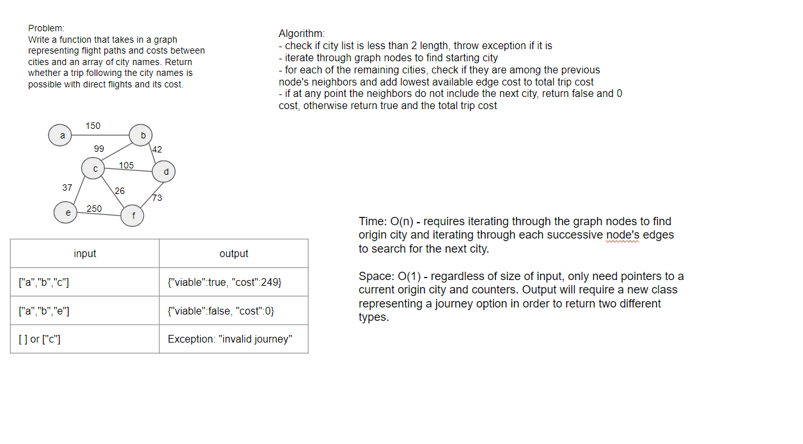

# Check Flight Paths

Given an itinerary and map, check if a trip is possible with direct flights and the cost.

## Challenge

Take a graph representing cities and the flights between and an array with city names representing cities to be visited in order. Check if it is possible to travel the list of cities using direct flights only. And also calculate the total cost of the collective flights.

## Approach & Efficiency

[Link to Code](src/main/java/DataStructures/graph/getEdge/GetEdge.java)

[Link to Graph implementation](src/main/java/DataStructures/graph/Graph.java)

In order to return both a boolean representing if the trip is viable and an integer representing the total cost, I started by creating a class called TripDetail. TripDetail simply holds a "viable" field and "cost" field.

The main method, checkTrip, starts by checking if the array of cities has a length less than two. If it does, then an Exception is thrown due to the itinerary not requesting any flights.

Next, the flight Graph is searched for a node containing the first city name. If that city is not in the Graph, then the itinerary cannot be completed and a TripDetail is returned with viable set to false and cost to 0.

Otherwise, a loop begins to check each successive destination in the list. If the destination is not found in the neighboring edges to the previous city, then a false/0 trip detail is returned. But if the destination city is located, the shortest route's weight is added to the total cost.

If the loop resolves, then it means the itinerary was completed. So a TripDetail with viable true and cost of the totaled trip cost is ready to return.

- O(n2) Time - A worst case on this would be a graph where every node is connected to every other node, possibly even multiple times. Every extra city would require iterating through at least one edge for every other city. A way to minimize this risk would be to cache the lowest edge between locations already visited.
- O(n) Space - The amount of space used is constant because this implementation always uses the same amount of pointers and counters. And it always creates an output of the same size.

## Solution

