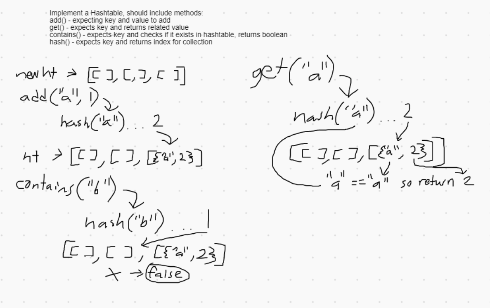

# Hashtables

An implementaion of a hash table data structure.

## Challenge

Create a Hashtable implementation that stores key/value pairs. It should include methods to add a key/value pair, get a value using a key, check if a key exists in the Hashtable, and an internal method to hash keys consistently.

## Approach & Efficiency

[Hashtable Class code](DataStructures/src/main/java/DataStructures/hashtable/Hashtable.java)

The base structure of this Hashtable implementation is a list of lists that each store nodes containing the key/value pairs. Anytime a key is added, it is passed through a protected hash method that converts the key into an index of the parent list. The child list at that index is checked for nodes that already contain the key, throwing an error if it is found. Otherwise, a new node is created with the given key and value and added to the child list.

To retrieve a value with the get method, the first step is to pass the key given through the same hash method as was used in the add method. This leads to the same index in the parent list, at which point the child list at that index is checked for the key.
If the key is found, then the value stored in the same node is returned. Otherwise, the get method throws an exception indicating that they key is not in the table.

The contains method follows the same logical pattern as the get method: hashing and searching for a key. The method returns true if the key is found and false if not.

Time efficiency is constant for initial use, but will very gradually increase with collisions (multiple nodes stored in the same child bucket).

The space efficiency is also constant, but it's worth noting that the initial instance of this Hashtable will create a batch of lists.

Time Efficiency:
  - add : O(1)
  - get : O(1)
  - contains : O(1)

Space Efficiency:
  - add : O(1)
  - get : O(1)
  - contains : O(1)

## API

Hashtable Methods:
  - add
    - takes in a string key and int value and stores them in the Hashtable
    - if the key already exists in the table, throws an exception
  - get
    - takes in a string key and returns the stored int value paired with that key
    - if they key does not exist in the hashtable, throws an error
  - contains
    - takes in a string key and checks if it exists in the hashtable
    - returns true if the key exists, false if not