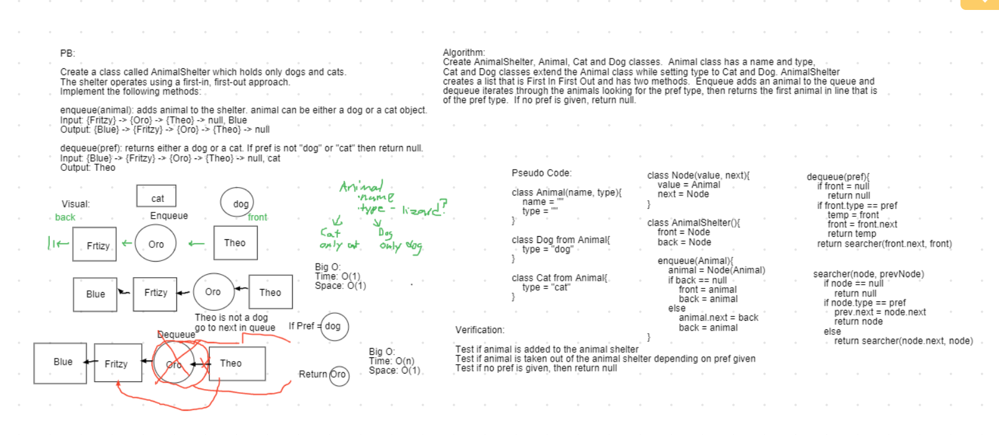

# Challenge Summary

A FIFO animal shelter.

## Challenge Description

Create an AnimalShelter class that operates like a queue. Its enqueue method should take in an animal that can be either a dog or cat and add it to the shelter queue. Its dequeue method should take in a preference of dog or cat and return the dog or cat that has spent the longest time in the shelter.

## Approach & Efficiency

In order to add and return animals, I started by building the Animal super class. Then created subclasses of Dog and Cat. Each dog and cat carries a type identifier field.

For the animal shelter, I used a singly-linked list structure with nodes that store the Animal class as a value. The enqueue method adds Animals nodes at the back of the queue unless its empty, in which case it gets added to the front.

The dequeue method immediately returns null if the shelter is empty or the preference given is not "cat" or "dog". Otherwise, it recursively checks nodes for a match to preference and returns that object. If it does find the object, it also links the previous node to the following node in order to maintain the queue order. if it doesn't find a match to the preference given, then passes a null to the top and returns it.

Time Efficiency:
  - enqueue : O(1)
  - dequeue : O(n)

Space Efficiency:
  - enqueue : O(1)
  - dequeue : O(1)

## Solution

