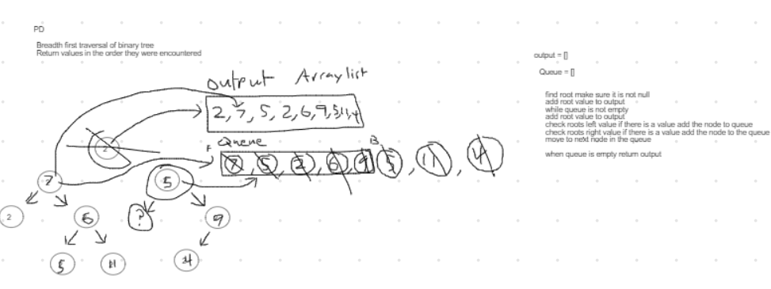

# Challenge Summary

Traversing a binary tree, breadth first.

## Challenge Description

Create a method to return a string representation of the values in a binary tree. The values should be ordered by rows starting at the root and continuing down.

## Approach & Efficiency

Started by checking the edge case of an empty tree and returning the String "null". If the tree isn't empty then the root node is stored in a queue. As long as the queue isn't empty, the node in front is popped out and its value is added to and output array. Any existing child nodes are then added to the back of the queue.

Once the queue is empty, the array is returned as a string.

Time Efficiency: O(n) (where n is the number of values in the tree)

Space Efficiency: O(n)

## Solution

