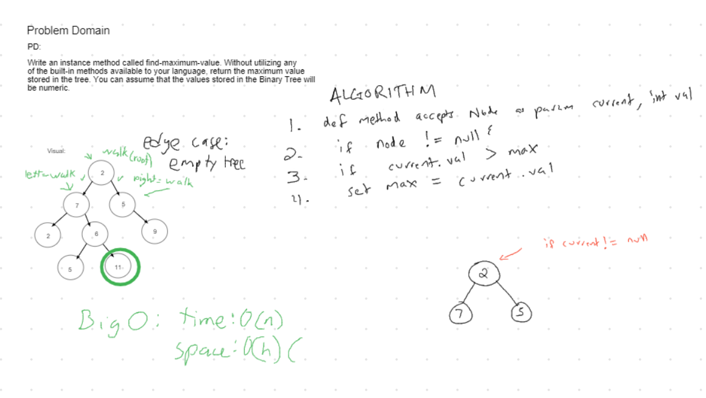

# Challenge Summary

Creating a method for finding a max in a binary tree.

## Challenge Description

Add an instance method to the BinaryTree class called findMaximumValue that returns the max value found in the instance of a binary tree.

## Approach & Efficiency

Created the findMaximumValue method requiring no parameters. It first checks for the edge case of the tree being empty and throws an exception if it is. Otherwise it makes use of a recursive helper method and passes it the root node. It returns the integer result of the helper method call.

The helper method checks its own value against the max values of its left and right children. Whichever value is highest of the three will be returned as an integer. The recursion is depth first and has a base case checking if the current node being checked is null. If it is null then it returns a minimum integer value that will naturally be less than its parent.

Time Efficiency: O(n) (where n is the number of values in the tree)

Space Efficiency: O(h) (where h is the height of the tree)

## Solution

