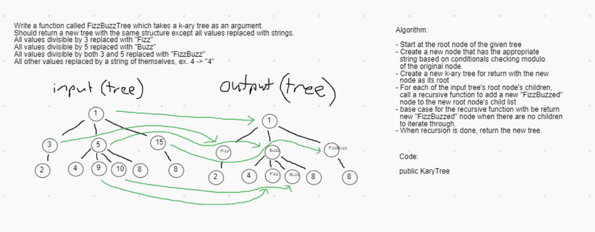

# Challenge Summary

FizzBuzz a K-ary Tree.

## Challenge Description

Create a method that takes in a K-ary Tree of integers and returns a "FizzBuzz" copy of that tree. All values divisible by 3 and 5 should change to "FizzBuzz". All values divisible by 3 should change to "Fizz". All values divisible by 5 should change to "Buzz". All other values should become the string version of their int value.

## Approach & Efficiency

I cycled through the input tree depth first using recursion. As the program passes through the nodes, it creates a new node for addition to the list of child nodes of the parent before it. During the node creation, a helper function is reference to get the "FizzBuzzed" version of the original nodes value.

Time Efficiency: O(n) (where n is the number of values in the tree)

Space Efficiency: O(h) (where h is the height of the tree)

## Solution

