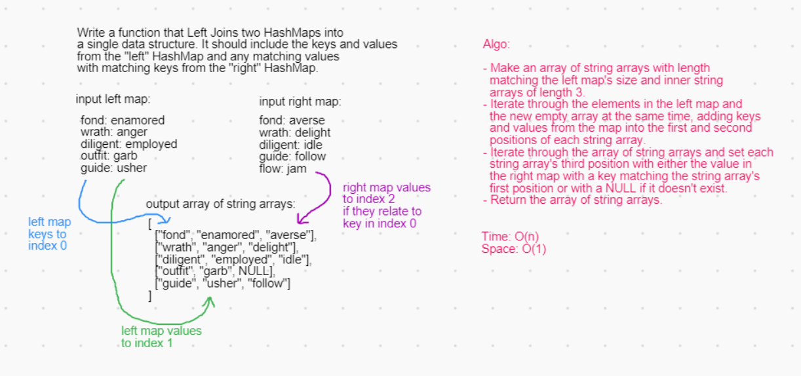

# Challenge Summary

Left join two HashMaps

## Challenge Description

Write a method that returns a data structure representing the result of two HashMaps after a left join on their keys.

## Approach & Efficiency

[link to code](src/main/java/utilities/LeftJoin.java)

Start by making an Array of String Arrays. Each of the child String Arrays will have a length of 3 for a key and two values. The parent Array gets its length from the size of the left HashMap.

Iterate in tandem through the keys of the left HashMap and the new Array's indexes. For each child array, set its first position with a key from the HashMap and its second position with the value stored at that key.

To join the right HashMap, iterate through the new Array one more time. Each of the child Arrays' first elements hold a key to reference. Use that key to get the related value from the right HashMap and set it into the child Array's third position. If the key is not present in the right HashMap, set the third position to "null" instead.

At this point, the Array made in the beginning is ready to return.

Time Efficiency: O(n) (the amount of operations grows linearly with the size of the left input map)

Space Efficiency: O(1) (the same space is used if ignoring the input and output)

## Solution

