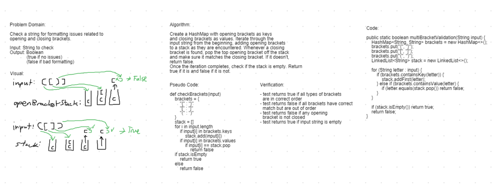

# Challenge Summary

Validate a string for bracket formatting.

## Challenge Description

Create a method that takes in a string and validates its bracket formatting by returning a boolean. Should return false if any brackets are out of order. Should return false if any brackets are orphaned (have no matching opening or closing bracket). Should return true if all opening brackets have matching closing brackets in a FILO format. Other characters should not affect the outcome.

## Approach & Efficiency

I started with a HashMap with closing brackets as keys and their corresponding opening brackets as values. And created an empty stack using the LinkedList data structure.

Iterating through the input string, I would check if each character matched any of the values in the HashMap. If so, it would be added to the top of the stack. If it instead matched one of the HashMap keys, then I would retrieve the corresponding bracket value to that key and compare it to the top value of the stack. If they were ever not the same, it means the brackets are out of order and returns false.

After the iteration, if the stack still have values, it means an opening bracket was never closed and returns false. If it's empty then it returns true.

This also covers the edge case of being passed an empty string. The stack will start empty and never be filled. So an empty string would return true at the evaluation of the stack.

Time Efficiency:
  - multiBracketValidation : O(n)

Space Efficiency:
  - multiBracketValidation : O(n)

## Solution

