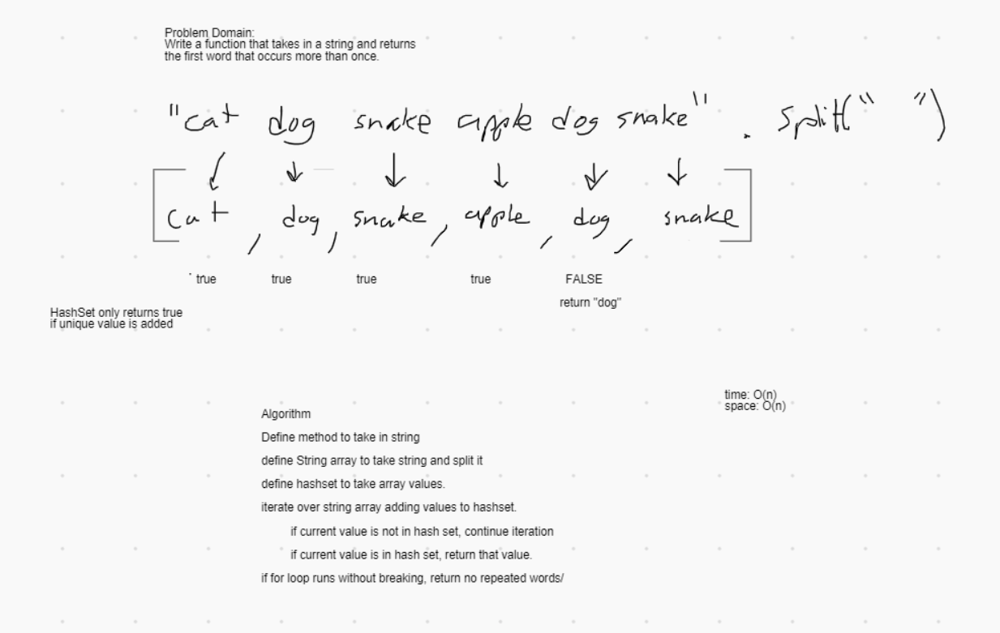

# Challenge Summary

Finding repeat words

## Challenge Description

Write a method to find the first repeat word in a lengthy string. Should be able to ignore differences in capitalization and punctuation.

## Approach & Efficiency

[link to code](src/main/java/challenges/RepeatedWord.java)

First, I took the input string and converted it to lowercase to avoid issues surrounding capitalization. Then I split the string into an array of words by calling the split() method and passing it regex targeting all consecutive non-word characters as delimiters.

While a HashMap is great for counting occurances of duplicate elements, a HashSet is perfect for locating the first duplicate. So I iterated through the array of words and added each of them to a HashSet using the add() method. The add() method returns true if the passed value is successfully added and false if it is already in the set. So at the first instance where the add method returns false, the word being added to the set is the first duplicate found. That word is then returned.

In the instance where there are no duplicates found, a NoSuchElementException is thrown indicating that no duplicates exist.

Time Efficiency: O(n) (the amount of operations grows linearly with the amount of words in the input string)

Space Efficiency: O(n) (in this implementation, both an array and set are created that increase in size linearly to the amount of words in the input string)

## Solution

