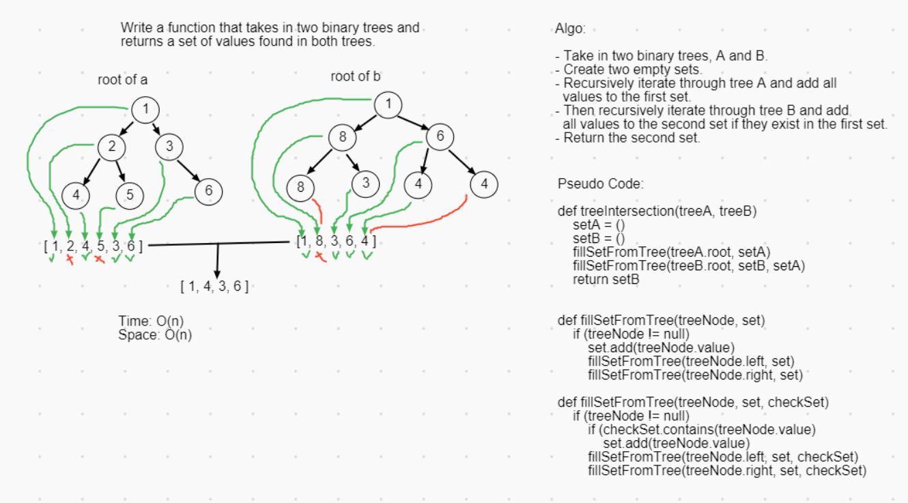

# Challenge Summary

Find common values in two binary trees

## Challenge Description

Write a method to find the all values common between two binary trees.

## Approach & Efficiency

[link to code](src/main/java/utilities/TreeIntersection.java)

[link to implementation of BinaryTree](src/main/java/tree/BinaryTree.java)

I started by creating two empty sets for storing unique values found in the given binary trees. `setA` is filled by recursively traversing the first tree and adding values. Sets do not accept duplicate values, so it ends up with only one instance of each value in the first tree.

The next step is to fill `setB` with unique values from the second tree. The only difference is that we already have all the values from the first tree stored in `setA`. So `setB` is filled by similarly traversing the second tree, except only values that are also in `setA` get added.

At this point, `setB` is ready to return. This conveniently accounts for any edge cases where the given trees do not have any common values or are empty. In either of those cases, `setB` will end up empty and be returned as is.

Time Efficiency: O(n) (the amount of operations grow linearly with the size of the binary trees)

Space Efficiency: O(n) (the size of the two sets grows linearly with the amount of distinct values in each binary tree)

## Solution

