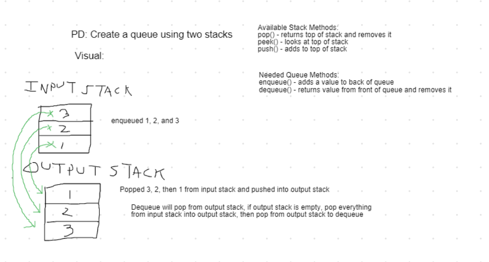

# Challenge Summary

Create a queue class using 2 stacks.

## Challenge Description

Using the previously created Stack class, create a new queue class called PseudoQueue that uses stacks instead of nodes. Must be able to enqueue and dequeue and can only access the pop, push, and peek stack methods.

## Approach & Efficiency

Instead of a front and back, we created an input stack and an output stack. The enqueue method simply uses the input stack's push method to add values to the PseudoQueue. In order to dequeue, those values need to be reversed. So if the output stack is empty, all the existing values in the input stack are popped out and pushed to the output stack.

When the values are swapped into the output stack, they are now in the correct order for the queue to return. So after the swap, or anytime there are values waiting in the output stack, dequeue just returns the "pop" of the output stack.

In the case that there is nothing in either stack, the PseueoQueue will throw a NullPointerException.

Time Efficiency:
  - enqueue : O(1)
  - dequeue : O(n) (O(1) if output stack is not empty)

Space Efficiency:
  - enqueue : O(1)
  - dequeue : O(1)

## Solution
<!-- Embedded whiteboard image -->

